# EPAM L3 Data Scientist Assessment Study Plan 🎯

**Goal:** Prepare for the L3 Data Scientist assessment, covering both the coding task and the presentation/Q&A sessions, focusing on demonstrating Senior Data Scientist competencies.

**Key Areas Mentioned:**

1.  **Coding Task (Classification) 💻:** 2.5 hours, offline, Jupyter notebook expected.
2.  **Technical Review Session 🧑‍🏫:** 45 mins (10 min walkthrough + 35 min Q&A on coding task).
3.  **Main Session 🎤:** 1.5 hours (10-15 min self-presentation + ~75 min Q&A on projects & theory).
4.  **Technology Focus 🔧:** Classical ML (especially classification), GenAI/LLMs (user's focus), underlying theory (Transformers, etc.).

## Study Plan Breakdown:

### Phase 1: Foundational ML & Coding Task Preparation (Focus: Pre-assessment readiness) 🧱

*   **1. Classification Fundamentals:**
    *   **Review:** Core concepts of binary and multi-class classification.
    *   **Algorithms:** Refresh common algorithms (Logistic Regression, SVM, Decision Trees, Random Forests, Gradient Boosting - XGBoost, LightGBM, CatBoost). Understand their pros, cons, and key hyperparameters.
    *   **Metrics 📊:** Deeply understand Precision, Recall, F1-score, AUC-ROC, Accuracy. Crucially, practice articulating *why* one metric is more important than others given a specific (hypothetical) business context. Prepare to justify your choice in the coding task.
    *   **Practice 🏋️:** Work through 2-3 tabular classification datasets (e.g., from Kaggle, UCI ML Repository). Time yourself to simulate the 2.5-hour limit.

*   **2. Standard Data Science Workflow Practice:**
    *   **EDA 🔍:** Practice thorough Exploratory Data Analysis. Look for data quality issues (nulls, types), distributions, correlations, potential data leakage, feature insights. Use visualization effectively.
    *   **Feature Engineering & Preprocessing ✨:** Practice techniques like handling missing values, encoding categorical features, scaling numerical features, feature selection, and potentially basic feature generation. Understand multicollinearity.
    *   **Modeling Pipeline ⚙️:** Implement clean pipelines (e.g., using `scikit-learn` Pipelines) for preprocessing, model training, and prediction.
    *   **Model Evaluation & Selection ✔️:** Practice comparing different models based on chosen metrics and cross-validation strategies.
    *   **Feature Importance 💡:** Practice generating and interpreting feature importance plots for tree-based models or using techniques like SHAP (though SHAP might be overkill for the time limit, understanding the concept is good).
    *   **Notebook Structure & Commenting 📝:** Practice structuring your notebook logically (e.g., Imports -> Load Data -> EDA -> Preprocessing -> Modeling -> Evaluation -> Conclusion/Rationale). *Critically*, practice adding clear markdown comments explaining your thought process, decisions, and rationale, especially regarding metric choices and feature insights. This was emphasized by Anton.

    ```mermaid
    graph TD
        A[Load Data] --> B(EDA 🔍);
        B --> C{Data Quality Issues?};
        C -- Yes --> D[Handle Issues];
        C -- No --> E;
        D --> E(Feature Engineering & Preprocessing ✨);
        E --> F(Split Data);
        F --> G(Modeling Pipeline ⚙️);
        G --> H(Train Models);
        H --> I(Evaluate Models ✔️);
        I --> J(Select Best Model);
        J --> K(Analyze Feature Importance 💡);
        K --> L(Document Rationale 📝);
    ```

*   **3. Tooling:**
    *   Ensure proficiency with core Python libraries: Pandas, NumPy, Scikit-learn, Matplotlib, Seaborn.
    *   (Optional) Have reusable snippets for common tasks like plotting confusion matrices or basic EDA visualizations ready, as Anton mentioned some candidates do.

### Phase 2: GenAI/LLM Deep Dive (Focus: Main Q&A readiness) 🤖🧠

*   **1. Transformer Architecture & Theory:**
    *   **Review:** How Transformers work. Focus on the Attention mechanism (self-attention, multi-head attention), positional encodings (including Rotary Embeddings - RoPE), encoder-decoder structure. Be ready to explain these concepts.
    *   **Embeddings:** Understand how word/token embeddings are generated and used.
    *   **Optimizations ⚡:** Review concepts like Flash Attention (as mentioned).

*   **2. LLM Training & Fine-tuning Concepts:**
    *   **Training:** Understand the overall pre-training process conceptually.
    *   **Fine-tuning:** Differentiate between full fine-tuning and parameter-efficient fine-tuning (PEFT).
    *   **Techniques:** Understand concepts like LoRA, prefix tuning, prompt tuning. Know *when* and *why* you might use fine-tuning vs. RAG.
    *   **RLHF 👍👎:** Understand the concept of Reinforcement Learning from Human Feedback.

*   **3. LLM Application & API Usage:**
    *   **RAG 📚:** Understand the architecture and components of Retrieval-Augmented Generation. Be ready to discuss its pros/cons vs. fine-tuning.

      ```mermaid
      graph TD
          A[User Query] --> B(Retrieve Relevant Docs 📚);
          B --> C(Combine Query + Docs);
          C --> D{LLM};
          D --> E[Generated Answer];
      ```

    *   **API Parameters:** Know the common API parameters (temperature, top_p/k) and their effect on generation.
    *   **Advanced Techniques:** Understand concepts like structured output generation, function calling (tool use), and basic Agentic workflows (ReAct pattern, etc.).
    *   **API Providers:** Be familiar with the nuances of the APIs you've used (Azure OpenAI, AWS Bedrock, Databricks).

*   **4. Open Source vs. Closed Source:**
    *   Even with limited hands-on open-source experience, understand the landscape conceptually. Know some major open-source models and the general trade-offs.

### Phase 3: Presentation & Q&A Preparation 🗣️❓

*   **1. Refine Self-Presentation:**
    *   **Conciseness ⏱️:** Heed Anton's advice. Aim for 10-15 minutes MAX. Reduce text, use visuals, focus on key messages.
    *   **Structure:** Consider a timeline, then 1 slide per key project (or group similar minor projects).
    *   **Content:** For each project, clearly state the business problem, your specific role and contributions, the techniques/technologies used, and the outcome/impact. Be explicit about what *you* did.
    *   **Appendix 📎:** Move detailed diagrams or less critical information to an appendix, ready to show if asked.
    *   **Practice:** Rehearse the presentation timing. Get comfortable speaking to the slides rather than reading them.

*   **2. Prepare for Project Q&A:**
    *   Review your past projects, especially those highlighted in your presentation and CV.
    *   Anticipate questions about your specific contributions, challenges faced, technical decisions made, alternatives considered, and results achieved.

*   **3. Prepare for Theoretical Q&A:**
    *   Review all topics from Phase 1 and Phase 2.
    *   Practice explaining concepts clearly and concisely, as if explaining to a colleague. Focus on the "how" and "why".
    *   Be prepared to discuss trade-offs between different approaches (e.g., different classification models, RAG vs. fine-tuning).

### Timeline & Logistics 🗓️

1.  **Now - Pre-assessment:** Focus on Phase 1 (Classical ML/Coding) and start reviewing Phase 2 (GenAI/LLM Theory). Begin refining your presentation (Phase 3). Complete the pre-assessment portal requirements (upload presentation).
2.  **Pre-assessment:** Treat it as a serious rehearsal. Pay close attention to the feedback provided by the committee.
3.  **Post Pre-assessment - Real Assessment:** Address any gaps identified in the pre-assessment feedback. Continue solidifying GenAI/LLM knowledge and practicing explanations. Finalize your presentation based on pre-assessment experience and Anton's example (if shared). Coordinate scheduling for the real assessment.

```mermaid
timeline
    title EPAM L3 Assessment Timeline
    section Coding Task
        Day X : Receive Dataset
        Day X : Solve Task (2.5 hrs) 💻
        Day X : Submit Notebook
    section Technical Review
        Day Y : Present Solution (10 min)
        Day Y : Q&A on Solution (35 min) 🧑‍🏫
    section Main Session
        Day Z : Self-Presentation (10-15 min) 🎤
        Day Z : Project & Theory Q&A (~75 min) ❓
```



### General Tips ✨

*   **L3 Expectations:** Remember the focus is on *understanding* and *articulating the why*, not just using tools. Depth matters more than breadth.
*   **Use Pre-assessment:** Leverage the pre-assessment fully to understand the process and identify weak spots.
*   **Clarify Contributions:** Be very clear about your specific role and impact in team projects.
*   **Practice Explaining:** Talking through concepts out loud helps solidify understanding and prepare for Q&A. 